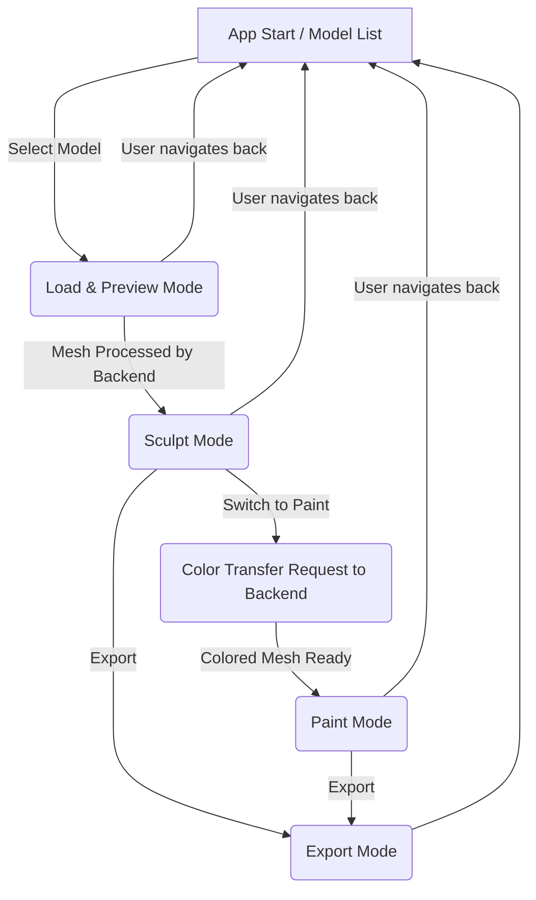

# 🎨 Mobile Sculpting App Architecture (Revised)

## 🧭 Overview
A beginner-friendly mobile sculpting app that allows users to load AI-generated 3D models (e.g., from Tripo), edit geometry through sculpting, and paint the model using vertex colors.

The app employs a **hybrid architecture**:
*   A **lightweight mobile frontend** built with React Native and Expo for UI, local interactions (sculpting, painting), and 3D rendering via `react-three-fiber`.
*   A **cloud-based Python backend** for computationally intensive tasks such as initial voxel remeshing of the model and transferring original texture colors to the sculpted mesh's vertices before painting.

---

## 🏗️ Technology Stack

### 🎛️ Frontend (Mobile React Native App)
*   **Framework**: React Native + Expo
*   **Language**: TypeScript
*   **3D Rendering**: `react-three-fiber` (Three.js for React)
*   **WebGL Context**: `expo-gl`
*   **3D Model Loading/Export (Client-side for preview/basic export)**: Three.js `GLTFLoader` and `GLTFExporter`
*   **UI Components**: `react-native-paper` (or similar React Native UI library)
*   **State Management**: Zustand
*   **Networking**: `axios` or TanStack Query (for interacting with the backend)
*   **Local File System**: `expo-file-system` (for saving projects or temporary files)
*   **Sharing**: `expo-sharing`

### 🧠 Backend (Python Server)
*   **Framework**: FastAPI (for creating robust APIs)
*   **Core 3D Processing (Python Libraries - Likely a Combination)**:
    *   **Primary Candidates for Core Tasks**:
        *   **`Blender` (via Python API, server-side)**: Used for mesh cleanup (removing loose geometry, fixing non-manifold edges, merging close vertices) and robust remeshing (e.g., voxel remesh, quad remesh). Blender is run headless on the cloud server and controlled via Python scripts.
        *   **`Trimesh`**: Essential for GLB/3D format I/O, basic mesh operations, repairs, and initial voxelization.
        *   **`Open3D`**: Strong for efficient spatial queries (e.g., KD-Trees for color transfer/reprojection from original texture to new mesh vertices) and can also offer robust voxel remeshing and surface reconstruction algorithms.
        *   **`PyMCubes` or `scikit-image.measure.marching_cubes`**: Focused libraries for performing the Marching Cubes algorithm if extracting a surface from a voxel grid generated by other means.
    *   **For Advanced or Specialized Tasks** (if primary candidates have limitations for a specific need):
        *   **`PyVista` / `vedo` (VTK wrappers)**: Access to VTK's comprehensive suite for complex filtering and geometric operations.
        *   **`MeshLab` (via `PyMeshLab` or `meshlabserver`)**: Useful for its extensive set of specific mesh filters, cleaning, and advanced repair algorithms.
        *   **`CGAL` (Python Bindings)**: Top-tier for highly robust, mathematically precise computational geometry tasks when other libraries may not suffice.
*   **Image Processing (for texture sampling)**:
    *   `Pillow` (PIL Fork): For loading and sampling texture images.
    *   `numpy`: For numerical operations, especially when dealing with vertex data, image pixels, and transformations.
*   **Hosting**: Options like DigitalOcean, Render, Fly.io, or serverless platforms (AWS Lambda, Google Cloud Functions) if FastAPI is adapted (e.g., with Mangum).
*   **Storage**: Supabase Storage or Amazon S3 (for original models if backend needs direct access, or for temporary processing files).
*   **Task Queue (for asynchronous operations)**: Celery + Redis (or RabbitMQ)

---

## 🔄 Modes, Workflow, and State Flows

The app primarily operates in distinct modes. Backend processing is utilized for initial model preparation and for preparing the model for vertex painting after sculpting.

### Overall App State Flow


### 📥 Mode 1: Load & Initial Process
**Goal:** Load a user-selected GLB, display a preview, and send it to the backend for voxel remeshing.

**Client-Server Interaction & State:**
```mermaid
sequenceDiagram
    participant Client (React Native App)
    participant Backend (Python API)
    participant ServerTaskQueue (e.g., Celery)

    Client->>Client: User selects model from Supabase list
    Client->>Supabase: Fetch/Download original GLB (Mesh_A_Original_Geo, Texture_A, Mesh_A_UVs)
    Client->>Client: Display preview of Mesh_A_Original_Geo with Texture_A
    Client->>Backend: API Call: ProcessModel(Mesh_A_Original_Geo URL/data)
    Backend->>ServerTaskQueue: Enqueue VoxelRemeshTask(Mesh_A_Original_Geo)
    Note over Backend,ServerTaskQueue: Backend immediately responds to client (e.g., ack, job ID)
    Client->>Client: Show "Processing model..." UI indicator

    ServerTaskQueue->>Backend: Worker picks up VoxelRemeshTask
    Backend->>Backend: Load Mesh_A_Original_Geo
    Backend->>Backend: **Perform Voxel Remeshing** (using Trimesh/Open3D) -> Mesh_B_Remeshed_Geo
    Backend->>Client: API Callback/Poll Response: ProcessedMeshReady(Mesh_B_Remeshed_Geo data)
    Note over Backend: Server retains Mesh_A_Original_Geo, Texture_A, Mesh_A_UVs for later color transfer

    Client->>Client: Store Mesh_B_Remeshed_Geo
    Client->>Client: Update UI: "Ready to Sculpt" / Enable Sculpt Mode
```
*   **Libraries Used (Client):** `axios`/`TanStack Query` (networking), `expo-gl` + `react-three-fiber` + Three.js `GLTFLoader` (rendering).
*   **Libraries Used (Backend):** `FastAPI`, `Trimesh`, `Open3D` or `PyMCubes`.

### ✍️ Mode 2: Sculpt
**Goal:** Allow user to deform the voxel-remeshed mesh locally on the client.

**Client-Side Operations & State:**
1.  **Input:** `Mesh_B_Remeshed_Geo` (from previous step).
2.  **Tools:** User interacts with sculpting tools (Move, Inflate, Smooth, Flatten). These tools directly manipulate the vertex positions of `Mesh_B_Remeshed_Geo`.
    *   Implemented using `react-three-fiber` event handlers (raycasting for touch-to-mesh intersection) and direct Three.js `BufferGeometry` attribute manipulation.
3.  **Output:** `Mesh_C_Sculpted_Geo` (the deformed version of `Mesh_B_Remeshed_Geo`).
4.  **State:** All sculpting operations and the resultant `Mesh_C_Sculpted_Geo` are managed locally on the client. No backend interaction is needed during the sculpting process itself.
*   **Libraries Used (Client):** `react-three-fiber`, Three.js (for geometry manipulation).

### 🎨 Mode 3: Paint (with Initial Color Transfer)
**Goal:** Transfer colors from the original model's texture to the sculpted mesh's vertices as a starting point, then allow local vertex painting.

**Client-Server Interaction & State:**
```mermaid
sequenceDiagram
    participant Client (React Native App)
    participant Backend (Python API)
    participant ServerTaskQueue (e.g., Celery)

    Client->>Client: User requests to switch to Paint Mode from Sculpt Mode
    Client->>Backend: API Call: RequestColorTransfer(Mesh_C_Sculpted_Geo data, original_model_identifier)
    Backend->>ServerTaskQueue: Enqueue ColorTransferTask(Mesh_C_Sculpted_Geo, original_model_identifier)
    Note over Backend,ServerTaskQueue: Backend immediately responds (ack, job ID)
    Client->>Client: Show "Preparing for paint..." UI indicator

    ServerTaskQueue->>Backend: Worker picks up ColorTransferTask
    Backend->>Backend: Load Mesh_C_Sculpted_Geo
    Backend->>Backend: Retrieve/Load associated Mesh_A_Original_Geo, Mesh_A_UVs, Texture_A
    Backend->>Backend: **Perform Color Transfer/Reprojection:**
    Note right of Backend: For each vertex in Mesh_C_Sculpted_Geo: <br/> 1. Find closest point on Mesh_A_Original_Geo. <br/> 2. Get UV from Mesh_A_UVs for that point. <br/> 3. Sample Texture_A at UV. <br/> 4. Assign color to Mesh_C vertex.
    Backend->>Client: API Callback/Poll Response: ColorTransferComplete(Mesh_C_Sculpted_Geo_With_VertexColors)

    Client->>Client: Store Mesh_C_Sculpted_Geo_With_VertexColors
    Client->>Client: Switch to Paint Mode UI
    Client->>Client: User paints locally, modifying vertex colors of Mesh_C_Sculpted_Geo_With_VertexColors
```
*   **Libraries Used (Client):** `react-three-fiber` (for rendering vertex colors and paint interaction).
*   **Libraries Used (Backend):** `FastAPI`, `Trimesh` (to handle geometry), `Open3D` (for KD-tree nearest neighbor search), `Pillow` + `numpy` (for texture sampling).

### 📤 Mode 4: Export
**Goal:** Allow user to export the finally edited model (sculpted geometry + final vertex colors) as a `.glb` file.

**Client-Side Operations (Primary for MVP):**
1.  **Input:** `Mesh_C_Sculpted_Geo` (with its final vertex colors after painting).
2.  **Operation:** Use Three.js `GLTFExporter` to serialize the current scene/model into a GLB format.
    *   The exporter will include the geometry and the vertex color attributes.
3.  **Output:** A `.glb` file saved locally using `expo-file-system`.
4.  **Sharing:** User can then share this file using `expo-sharing`.
*   **Libraries Used (Client):** Three.js `GLTFExporter`, `expo-file-system`, `expo-sharing`.

**Optional Server-Side Export (Post-MVP or for complex cases):**
If client-side export proves problematic or for more complex export requirements (e.g., including original textures alongside, ensuring spec compliance), the client could send the final mesh data to a backend endpoint that uses `Trimesh` to robustly generate and validate the GLB.

---

## 🧰 Key Tools and Libraries Summary

| Component / Task             | Frontend Tool / Library                     | Backend Tool / Library                                  |
|------------------------------|---------------------------------------------|---------------------------------------------------------|
| **App Framework**            | React Native + Expo                         | FastAPI                                                 |
| **3D Rendering & Scene**     | `react-three-fiber`, `expo-gl`              | -                                                       |
| **GLB Loading (Initial)**    | Three.js `GLTFLoader`                       | `Trimesh`                                               |
| **UI Components**            | `react-native-paper`                        | -                                                       |
| **State Management**         | Zustand                                     | -                                                       |
| **Networking**               | `axios` / TanStack Query                    | -                                                       |
| **Local Sculpting**          | `react-three-fiber`, Three.js geometry ops | -                                                       |
| **Local Vertex Painting**    | `react-three-fiber`, Three.js vertex attrs  | -                                                       |
| **Voxel Remeshing**          | - (Sends to backend)                        | `Trimesh`, `Open3D`                                     |
| **Color Transfer/Reproject** | - (Sends to backend)                        | `Open3D` (KD-Tree), `Trimesh`, `Pillow`, `numpy`        |
| **GLB Export (Client)**      | Three.js `GLTFExporter`                     | `Trimesh` (Optional, for robust/complex export)         |
| **Async Task Management**    | -                                           | Celery + Redis                                          |
| **File System / Sharing**    | `expo-file-system`, `expo-sharing`          | -                                                       |

---

## 📦 Feature Table (MVP Focus)

| Feature                                     | MVP | Client/Server | Notes                                                                      |
|---------------------------------------------|-----|---------------|----------------------------------------------------------------------------|
| Load `.glb` from Supabase (with texture)    | ✅  | Client        |                                                                            |
| **Backend**: Voxel Remesh loaded model      | ✅  | Server        | Async, provides sculptable mesh to client                                  |
| Display preview of original/remeshed model  | ✅  | Client        |                                                                            |
| Sculpting Tools (Move, Inflate, Smooth, etc.)| ✅  | Client        | Operates on remeshed model locally                                         |
| **Backend**: Color Transfer to Sculpted Mesh| ✅  | Server        | Async, transfers original texture color to sculpted mesh as vertex colors  |
| Vertex Painting (on color-transferred mesh) | ✅  | Client        | Local painting operations                                                  |
| Export final sculpted & painted model as `.glb` | ✅  | Client        | Primarily client-side using Three.js `GLTFExporter`                          |
| Undo/Redo for sculpt & paint (basic)      | ✅  | Client        | Command pattern for local actions                                          |
| Save project state locally (simple)         | ✅  | Client        | e.g., save current GLB state to local file system                         |
| Navigate between modes/model list           | ✅  | Client        |                                                                            |
| Render static snapshot (image) of model   | ✅  | Client        | `expo-gl` `takeSnapshotAsync()`                                             |
| Share snapshot or model file              | ✅  | Client        | `expo-sharing`                                                              |

---

## ✅ MVP User Experience Goals
*   **Instant Preview:** User loads a model and sees it quickly (original texture).
*   **Clear Background Processing:** User is informed when the model is being processed by the backend (remeshing, color transfer) with non-blocking UI.
*   **Responsive Sculpting & Painting:** Local tools should feel interactive.
*   **Seamless Transitions (as much as possible):** Minimize perceived wait times when switching to sculpt mode (after remesh) or paint mode (after color transfer). The app should guide the user if a backend process is still running.
*   **Easy Export & Share:** Simple one-tap export and sharing of the final creation.
*   **Focus on Simplicity:** The user interacts with geometry and color without needing to understand complex 3D concepts unless they choose to.

---

## 🚀 Future Potential Features (Post-MVP)
*   Advanced texture-based painting (requiring UVs on the remeshed model, potentially generated by backend).
*   Layered sculpting and painting.
*   Symmetry tools.
*   More advanced local save/project management.
*   Offline support for sculpting/painting cached models (backend steps would still require online).
*   Community features.

---

## 🚀 Post-MVP: Mobile Mesh Optimization Pipeline (Client-Side Preprocessing)

**Goal:** Reduce file size and processing overhead by cleaning and compressing 3D models on-device before upload.

**Approach:** Native C++ Module via React Native Bridge

**Recommended Libraries:**
- **MeshOptimizer:** Fast, lightweight library for mesh simplification, vertex deduplication, and reordering. Ideal for reducing vertex count while preserving shape.
- **OpenMesh:** General-purpose mesh processing library supporting decimation, smoothing, and topology fixes.
- **Assimp:** Import/export and basic repair of various 3D formats. Useful for format conversion and compatibility checks.

**Pipeline:**
1. Load `.glb` or `.obj` file in React Native.
2. Pass file to native module (C++) for cleanup:
    - Deduplicate vertices
    - Merge close vertices
    - Optional simplification (e.g., reduce from 200k to 80k triangles)
3. Optionally compress using Draco or gzip (via native or JS).
4. Upload optimized file to server for remeshing and color projection.

**Benefits:**
- 50–90% reduction in upload size.
- Faster transfer, lower memory usage.
- Cleaner meshes reduce server processing time and Blender failures.

This architecture is ideal for performance-sensitive mobile apps that handle 3D sculpting workflows.
